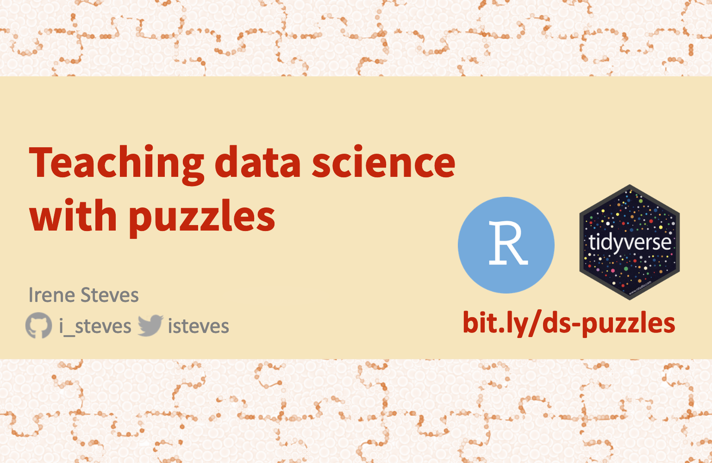

Teaching data science with puzzles
==================================

### rstudio::conf 2019, [slides](https://speakerdeck.com/isteves/teaching-data-science-with-puzzles)

Of the many coding puzzles on the web, few focus on the programming
skills needed for handling untidy data. During my summer internship at
RStudio, I worked with Jenny Bryan to develop a series of data science
puzzles known as the “Tidies of March.” These puzzles isolate data
wrangling tasks into bite-sized pieces to nurture core data science
skills such as importing, reshaping, and summarizing data. We also
provide access to puzzles and puzzle data directly in R through an
accompanying Tidies of March package. I will show how this package
models best practices for both data wrangling and project management.

If you’d like to take a closer look at the sandwiches example from the
talk, check out the [sandwiches
folder](https://github.com/isteves/ds-puzzles/tree/master/11_sandwiches)
in this repo.

Additional resources
--------------------

-   [How to name
    files](https://speakerdeck.com/jennybc/how-to-name-files) talk by
    Jenny Bryan
-   [A summer of puzzles at
    RStudio](https://irene.rbind.io/post/summer-rstudio/) blogpost about
    my internship experience
-   [it’s not the maths, it’s the code - how testing has changed my
    workflow](http://cantabile.rbind.io/posts/2019-01-05-its-not-not-the-math-its-the-code/)
    blogpost by Charles T. Gray

Packages mentioned in my talk:

-   [usethis](https://usethis.r-lib.org/) - a workflow package: it
    automates repetitive tasks that arise during project setup and
    development, both for R packages and non-package projects
-   [testthat](https://testthat.r-lib.org/) - to make testing fun
-   [testrmd](https://github.com/ropenscilabs/testrmd) - test chunks for
    RMarkdown
-   [reprex](https://reprex.tidyverse.org/) - render bits of R code for
    sharing, e.g., on GitHub or StackOverflow
-   [rmarkdown](https://rmarkdown.rstudio.com/) - create reproducible
    text and analyses

Thank yous
----------

A big thanks to the Tidyverse team, fellow interns, and RStudio folks
for a fun & interesting summer!

Also thanks to Maria Novosolov, Alex Slavenko, Alex Hayes, Steven Chong,
and Julien Brun for their comments and support in early versions of this
talk!
